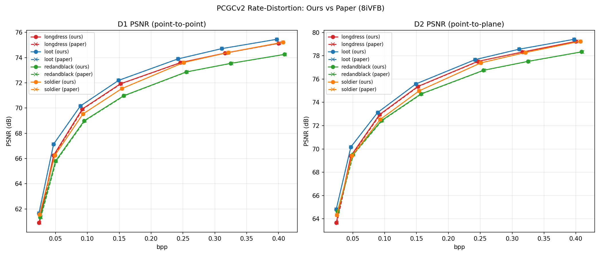
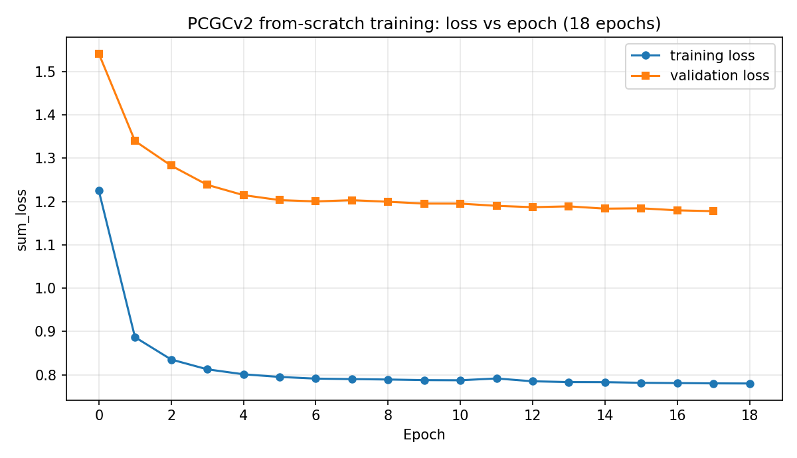

# PCGCv2 — Reproduction Study

A reproduction of **PCGCv2** (*Multiscale Point Cloud Geometry Compression*, Wang et al., DCC 2021).

> **This is a reproduction study, not original research.**
> I did not design the method, write the model, or train the released checkpoints.
> The algorithm, source code, pre-trained models, and test data are all the work of the
> original authors (see [Original work](#original-work)). This repository contains only
> *my own* reproduction report, result figures, training log, and study notes — it does
> **not** include the PCGCv2 source code. To run PCGCv2, clone the
> [original repository](https://github.com/NJUVISION/PCGCv2) directly.

**Where this sits.** PCGCv2 is the multiscale sparse-tensor foundation that the learned
point cloud coding line is built on, and reproducing it was the groundwork for my ongoing
master's thesis on point cloud *attribute* compression (FAU LMS, submission December 2026).
That later work is separate and not in this repository. This one remains what it says above:
a reproduction study, not original research.

The goal of the exercise was the **"reproduce the paper's metrics"** level of reproduction:
not merely getting the code to run, but obtaining bpp / D1 PSNR / D2 PSNR on the same
8iVFB dataset, drawing the rate–distortion curves, and checking them against the authors'
officially published results.

## Updates

<!-- New entries go to the TOP. Old entries are NEVER modified.
     Date format: YYYY-MM-DD. -->

- **2026-08-15** — Cross-linked the evaluation and corpus tooling. The BD-rate and RD-curve arithmetic used here is now available as a standalone package, pcc-eval-toolkit, which also adds bit-exact round-trip verification. Corpus-side occupancy statistics live in pcc-corpus-probe. Added a positioning note connecting this reproduction to the ongoing attribute-compression thesis; the reproduction results and their limitations are unchanged.

## Original work

- **Paper:** Jianqiang Wang, Dandan Ding, Zhu Li, Zhan Ma. *Multiscale Point Cloud Geometry Compression.* DCC 2021. [arXiv:2011.03799](https://arxiv.org/abs/2011.03799)
- **Code:** <https://github.com/NJUVISION/PCGCv2> (NJUVISION)

All credit for the method and the released models belongs to those authors.

## What I reproduced

Using the authors' **pre-trained models** (rate points r1–r7) and the standard 8iVFB test
sequences, I ran `test.py` on four sequences — longdress, loot, redandblack, soldier —
producing one rate–distortion curve (seven points) per sequence, then compared every point
against the authors' official result CSVs bundled in the repository.



Solid lines are my results; dashed lines are the authors' official results. The two
overlap almost exactly. Comparing all **28 points** (4 sequences × 7 rate models)
numerically, the largest deviation in D1/D2 PSNR from the official results was
**0.0025 dB** — a difference at the level of floating-point non-determinism in the coding
process. Within that tolerance the results match the published numbers.

Representative numbers for the `longdress` sequence (full tables for all four sequences are
in the [reproduction report](report/)):

| Rate model | bpp | D1 PSNR (dB) | D2 PSNR (dB) |
|---|---|---|---|
| r1 | 0.024 | 60.89 | 63.65 |
| r2 | 0.047 | 66.25 | 69.41 |
| r3 | 0.092 | 69.92 | 72.96 |
| r4 | 0.152 | 71.93 | 75.37 |
| r5 | 0.246 | 73.60 | 77.52 |
| r6 | 0.316 | 74.36 | 78.33 |
| r7 | 0.400 | 75.13 | 79.24 |

## From-scratch training (optional extension)

As a further check I also ran `train.py` to train a model from scratch on the authors'
training set (~3.7 GB, ~20k `.h5` point clouds). Cloud-GPU budget was limited, so I stopped
at **epoch 18 of the paper's 50** (~9 hours of training).



Both training and validation loss drop quickly in the first few epochs and then flatten,
with no divergence or oscillation — the training pipeline runs correctly and the model
converges. The epoch-18 checkpoint scored D1 PSNR ~0.3–0.5 dB below the authors'
fully-trained model at a comparable bitrate. That gap is consistent with having done only
about a third of the training; it confirms the training procedure works, but is **not** a
claim of matching the paper's trained model. Reproducing that would need the full 50 epochs.

## Environment

PCGCv2 depends on **MinkowskiEngine** (sparse convolution), which requires an NVIDIA CUDA
GPU; my Mac has none, so the whole reproduction ran on a rented cloud GPU.

| Component | Version / Configuration |
|---|---|
| Cloud platform | RunPod (pay-as-you-go GPU cloud) |
| GPU | NVIDIA RTX 3090, 24 GB VRAM (Ampere) |
| OS | Ubuntu 18.04 |
| Container image | `pytorch/pytorch:1.8.1-cuda11.1-cudnn8-devel` |
| Python | 3.8.8 |
| CUDA | 11.1 (V11.1.105) |
| PyTorch | 1.8.1 + cu111 |
| MinkowskiEngine | 0.5.4 (compiled from source) |
| torchac | 0.9.3 |
| tmc3 | v12 (binary bundled in the repo) |
| Other | h5py, pandas 1.1.5, open3d 0.13, matplotlib 3.3.4, ninja |

The Python 3.8 / CUDA 11.1 / PyTorch 1.8.1 combination compiled MinkowskiEngine on the
first try; newer CUDA versions are reported to fail.

## Reproduction challenges (summary)

The full account is in the [report](report/); the main pitfalls were:

- **MinkowskiEngine compilation** — the riskiest step; only succeeded by pinning the exact
  Python 3.8 / CUDA 11.1 / PyTorch 1.8.1 versions and pre-installing `libopenblas` + `ninja`.
- **Cloud platform** — could not pass real-name verification on AutoDL from outside China;
  switched to RunPod. RunPod's default image is CUDA 12.4, so a custom CUDA-11.1 image and
  an Ampere-generation GPU were both required.
- **Ephemeral disk** — RunPod resets the container disk on stop; everything had to live in
  the persistent `/workspace` volume, with a `rebuild.sh` to restore the environment.
- **Slow data download** — the Nanjing University netdisk was tens of KB/s from abroad;
  `aria2` multi-threaded download brought it to ~3 MB/s.
- **Dependency conflicts** — `pandas` pinned to 1.1.5 and `matplotlib` to 3.3.4 to avoid
  pulling incompatible NumPy/torch versions.
- **`test.py` overwrote the authors' official result CSVs** in `results/`; restored them
  via `git` so the numerical comparison was still possible.

## Repository contents

```
pcgcv2-reproduction/
├── README.md
├── report/        Reproduction report — English (.docx/.pdf) and original Chinese (_zh)
├── figures/       rd_curve.png (RD curves), train_loss.png (training loss)
├── docs/          Study & planning notes (translated from the author's Chinese originals)
│   ├── 7-day-reproduction-plan.md
│   ├── pre-work-preparation.md
│   ├── understanding-from-scratch.md
│   ├── glossary.md
│   └── glossary-with-examples.md
└── logs/          training_epoch1-18.log — raw log from the from-scratch training run
```

## Related repositories

Tooling that came out of this reproduction and the work that followed it:

- [pcc-eval-toolkit](https://github.com/Tianhao1314/pcc-eval-toolkit) — BD-rate / BD-PSNR,
  RD curves and MPEG-CTC-style reporting, plus codec-agnostic bit-exact round-trip
  verification. The RD arithmetic behind the curves above, packaged and tested. Contains no
  codec.
- [pcc-corpus-probe](https://github.com/Tianhao1314/pcc-corpus-probe) — multiscale occupancy
  statistics for point cloud corpora, and a measure of how far apart two corpora sit.
- [pcc-notes](https://github.com/Tianhao1314/pcc-notes) — learning notes on point cloud
  compression: representations, geometry and attribute coding, entropy models, evaluation.

## License & attribution

The reproduction report, figures, training log, and study notes in this repository are my
own work and may be used for academic reference with attribution. The PCGCv2 **method and
source code** are not included here and remain the property of their original authors under
the license of the [original repository](https://github.com/NJUVISION/PCGCv2).

— Tianhao Wu, 2026
